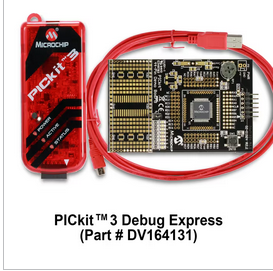

# pickit3-debug-express-CX8-version-lessons

Beause the old zip examples don't compile with the new CX8 compiler.

So these examples revisited are OK now.

<a href="https://www.microchip.com/en-us/development-tool/DV164131">PICKIT 3 DEBUG EXPRESS : DV164131</a>

Note : "PICkit 3 Debug Express Lessons.zip" is an old version
